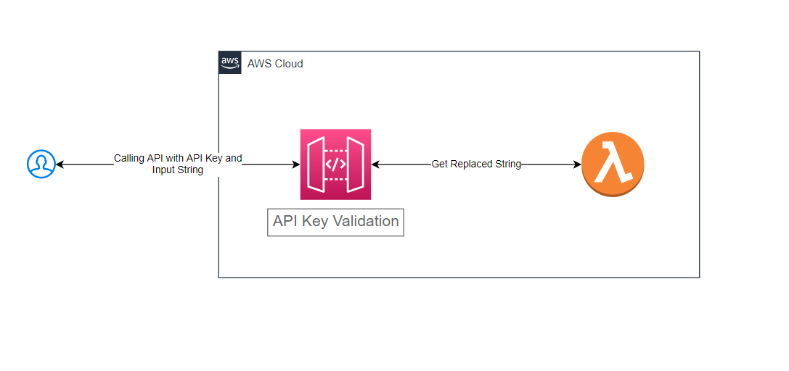

# String Replacer API (Deloitte Assignment)

## Pre-requisites for running the project
* An AWS Account
* Download and Install aws-cli using https://aws.amazon.com/cli/
* Configure AWS credentials. Run the command `aws configure` and follow enter the AWS credentials
* Install Terraform CLI using https://www.terraform.io/

<br />

## Deploying the Resources
Run the script deploy.sh to deploy the resources. **Note the Script output for API Endpoint.**

```
Syntax: ./deploy.sh -r <AWS_REGION> -e <ENVIRONMENT> -p <AWS_PROFILE>
Example: ./deploy.sh -r eu-west-1 -e test -p default
```

All the arguments to the deploy script are optionals. The argument descriptions and default values are mentioned below

Argument | Description | Default Value
--- | --- | --- 
r | AWS Region to use for deploying all the resources | eu-west-1
p | AWS Configuration Profile to use for deploying all the resources | default
e | Deployment Environment. Supported values: test, prod  | test

<br />

## Calling the API

*Required Inputs* <br />

Input | Value 
--- | ---
API Endpoint | From the deployment script output
API Key (Header: x-api-key) | From the deployment script output
HTTP Method | POST
Body Input | { "inputString": "<<INPUT_STRING>>" }

<br />

*cURL Command* <br />

```
curl --location --request POST '<<API_ENDPOINT>>' \
--header 'x-api-key: <<API_KEY>>' \
--data-raw '{
    "inputString": "<<INPUT_STRING>>"
}'
```

## Architecture Diagram

